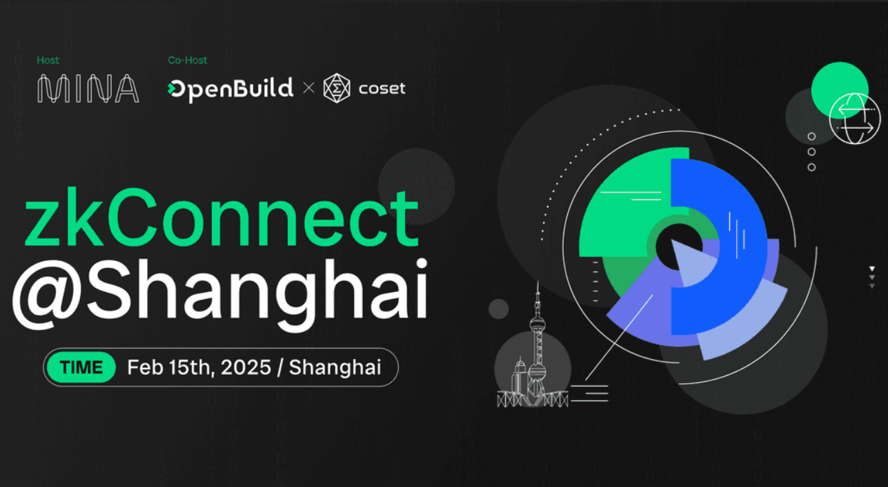
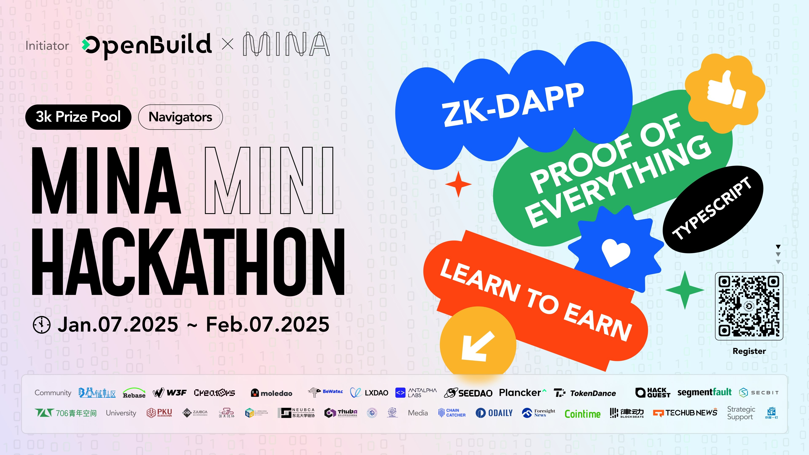
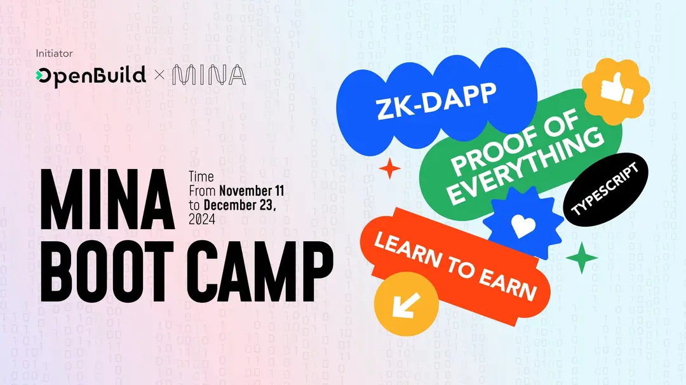
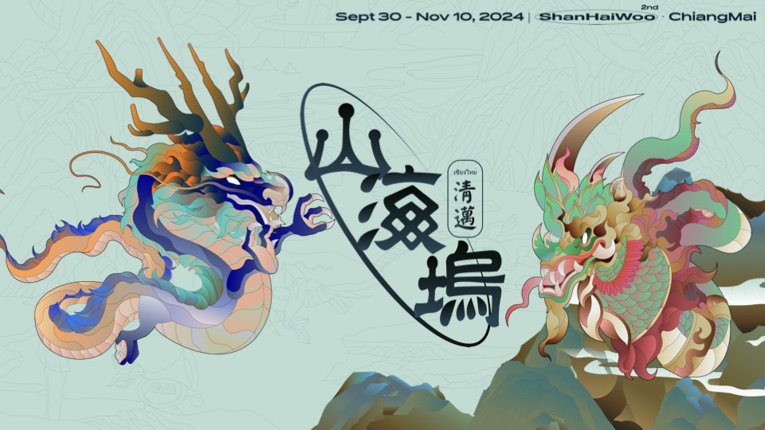
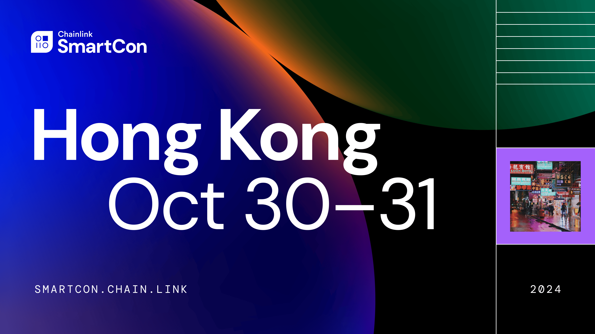
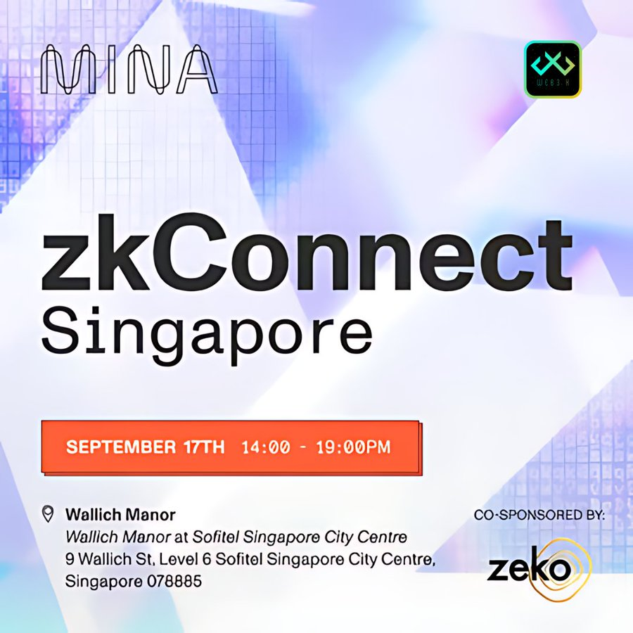
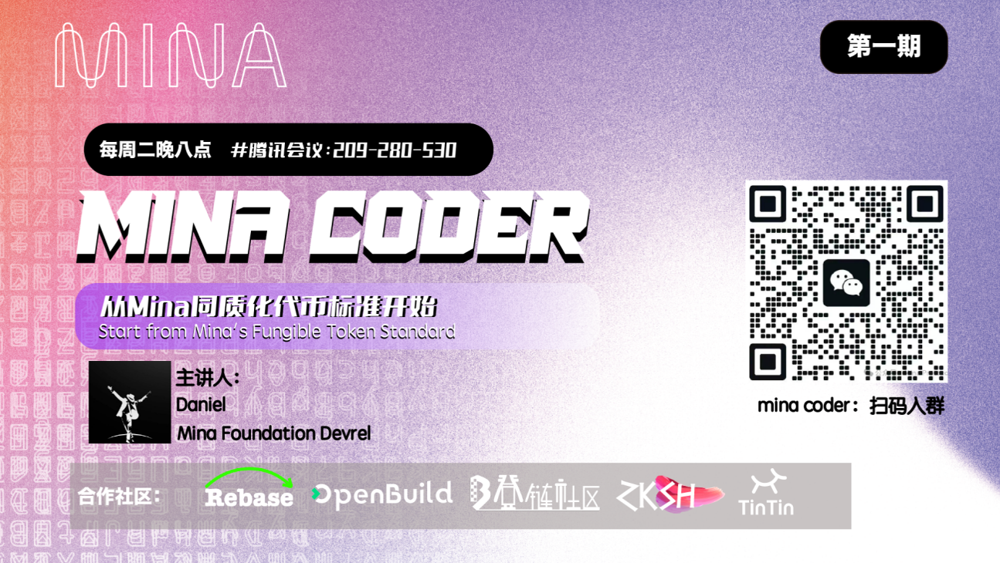
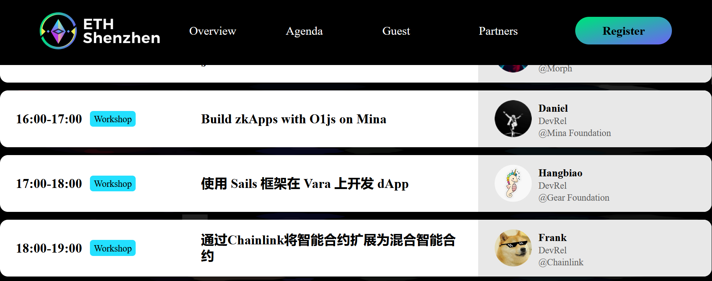
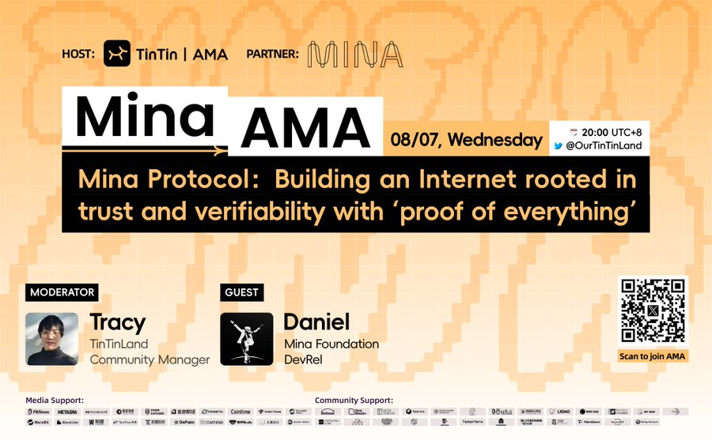

# Journey-in-Mina

During my year as the Apac DevRel at [Mina Protocol](https://x.com/MinaProtocol), it was an incredibly challenging yet rewarding journey. The work was intense but incredibly fulfilling. Every offline or online event deepened my understanding and passion for the Web3 ecosystem. 

I would like to express my special gratitude to [David](https://x.com/davidandpassion) for his kind guidance. It was your trustful invitation that opened up an important chapter in my career. I am even more grateful for the team's consistent tolerance and support, which enabled me to continuously expand my professional boundaries during project challenges and cross-cultural collaborations. This experience not only allowed me to make breakthroughs in cutting-edge technologies such as zero-knowledge proof and decentralized application architecture, but also led to a leapfrog growth in the establishment of a global network of Web3 connections.

在[Mina Protocol](https://x.com/MinaProtocol)担任Apac DevRel的这一年，是一段充满挑战与成长的旅程。工作强度大却无比充实，每一场线下/线上活动都加深了我对Web3生态的理解与热爱。

特别感谢[David](https://x.com/davidandpassion)的知遇之恩，是您的信任邀请开启了我职业生涯的重要篇章；更感恩团队始终如一的包容与支持，让我在项目攻坚和跨文化协作中不断提升专业边界。这段经历不仅让我在零知识证明、去中心化应用架构等前沿技术领域实现突破，更在Web3全球人脉网络的构建上获得跨越式成长。

## MileStones as Mina APAC DevRel

### zkConnect @ShangHai：探索 zk 技术的应用和未来

https://openbuild.xyz/learn/challenges/2060959930

* **Achievement**: 
  * 3-hours event, 
  * ~100 zk enthusiasts joined offline event, 
  * ~300 zk fans into online group.

### Mina Hackthon

https://x.com/OpenBuildxyz/status/1878720202709643431

* **Achievement**: 
  * one-month event, 16teams joined. 3 teams won.
  * https://x.com/coldStar1993/status/1889666848687546649

### Mina Bootcamp with OpenBuild

[activity page](https://openbuild.xyz/learn/challenges/2051400317) & [tutorial design](https://github.com/coldstar1993/Mina-ZkApp-Tutorials)

* **Achievement**:
  * [19 tutorial videos]((https://www.youtube.com/watch?v=4a8n7A2fGZs&list=PLHNmWBpo58LWuKsyOF1qCe5qM9W45CAlV)) for zkApp dev, along with 4 online AMA
    * [Mina x OpenBuild zkApp 训练营 ](https://github.com/openbuildxyz/mina-zkapp-bootcamp), 
    * videos in [youtube](https://www.youtube.com/watch?v=4a8n7A2fGZs&list=PLHNmWBpo58LWuKsyOF1qCe5qM9W45CAlV). 
  * Registered Participants: 347
  * Developer of task submitted: 216
  * GitHub Code Task PR: 462
  * Promotion Channels and Data
    * Twitter, weChat Official account article, community and University Partner etc.
    * Total 50,000+ Impressions

### Mina Cert Program
The certification program is intended to be a Computer Based Training (CBT) program, split into six sections with questions at the end of each section verifying that the participant has completed the section and understood the content. On completion the participant will receive a certification that can then be posted on social media (LinkedIn, X/twitter etc.) 

### Shanhaiwoo

https://x.com/shanhaiwoo/status/1854079766498095430

* **Achievement**:
  * 90-mins offline workshop on 《Build ZkApps on Mina》
  * connect famous zk teams, like [SECBIT Labs](https://secbit.io/) & [Invisible Garden](https://x.com/invisiblgarden) & [Social layer](https://x.com/SocialLayer_im/), etc.

### HK SmartCon 2024

https://www.lfdecentralizedtrust.org/events/chainlink-smartcon-2024

* **Achievement**:
  * 2-days booth, served more than 200 members
  * joined several side events

### zkConnect Singapore - Token2049

https://lu.ma/xtytmy9q

* **Achievement**
  * 60 members joined offline zkConnect event
  * assisted mina event in Token2049 

### Mina Coder Weekly Program

* **Achievement**:
  * 90mins on idea/code sharing, 
  * >30 zk fans joined per event.

### Build Mina China Account Matrix
* started to design&build [MinaPulse Platform](https://www.minapulse.com/zh)

* built Substack Official Account: [minaprotocolchina.substack](https://minaprotocolchina.substack.com/)

* built WeChat Official Account:
  
  

### ETHSHENZHEN workshop

https://www.ethshenzhen.org/

* **Achievement**:
  * Offline Workshop: 《Build zkApps with O1js on Mina》
  * >100 audiences offline

### TinTinLand X Space Sharing

https://x.com/OurTinTinLand/status/1822981525354524999

* **Achievement**:
  * X space topic: 《MinaProtocol：Building an Internet rooted in trust and verifiability with ‘Proof of Everything’》,
  * 110mins sharing with Peak ~1000 audiences, Totally 18000 audiences,

## Events in Mina Eco (TBD)

(TBD) as an active mina fan to join mina activities

### build o1js-merkle library

    (TBD)

    https://github.com/plus3-labs/o1js-merkle (TBD)

### Navigator Grant program

    (TBD)

### zkIgnite Cohort3

#### built Anomix Network upgrade
     
     (TBD)

     https://github.com/anomix-zk/anomix-network/blob/main/doc-ch3/zkIgnite-cohort3-proposal-683-Anomix-Network.md 

### zkIgnite Cohort2

#### invited & designed & built Tokenizk

(TBD)

     https://github.com/TokeniZK/tokenizk-finance/ 

### zkIgnite Cohort1

(TBD)

#### built Anomix Network

    (TBD)

    https://github.com/anomix-zk/anomix-network/blob/main/docs/README.md

### ...
